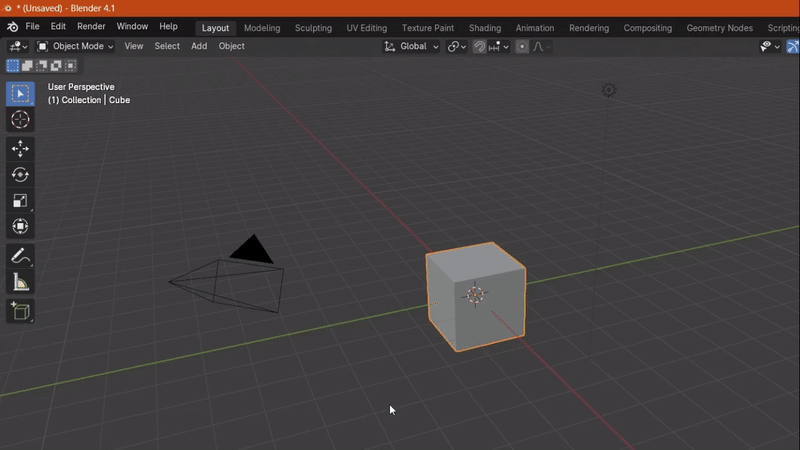
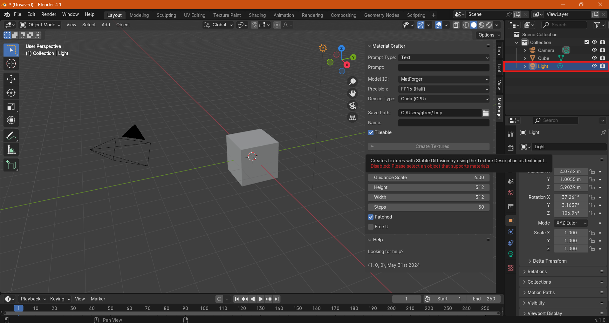

<h1 align="center">Material Crafter</h1>

Generate SVBRDF materials using Latent Diffusion Models, without leaving Blender.

## Minimum requirements

- [Python 3.8+](https://www.python.org/downloads/)
- [Blender 4.1+](https://www.blender.org/download/)
- [CUDA drivers 12.1+](https://developer.nvidia.com/cuda-downloads)
- 4GB+ NVIDIA GPU
- ~15GB free storage space

## Usage
1. Download the `.zip` file from this repository

2. Open Blender, then `Edit -> Preferences -> Add-ons -> Install` 

3. Select the zip file you downloaded

**⚠️ NOTE**: It is recommended to open the output console from `Window -> Toggle System Console` 

4. Accept the licenses and run the installation of the dependencies. This will create a python virtual environment (venv) in the specified path and install a set of predefined libraries.

    **⚠️ IMPORTANT**: this will take some time and Blender will hang until the installation has finished. Follow step 2 to open the output console and monitor the installation progress.

5. Now, you will find Material Crafter on the right side of the panel, clicking on the arrow.

6. Specify your prompt and generation parameters and click on `Create Textures`. 
   

    
**⚠️ NOTE**: before generating texture maps, you need to select an object you want to apply it to.

7. Now you material should be applied to your selected object. If you want to see your texture maps, they are also saved in a local folder, specified in the input field.

   
   **⚠️ NOTE**: To visualize the material applied to the mesh, remember to set the `Viewport Shading` to `Material Preview` or `Rendered `

8. You can see in the Shader tab that a new material has been created, named `M_MC_{MATERIAL_NAME}`, and the generated maps have already been assigned their own corresponding node.

### Credits
Thanks to [Cozy Auto Texture](https://github.com/torrinworx/Cozy-Auto-Texture) for serving as a reference to this codebase.